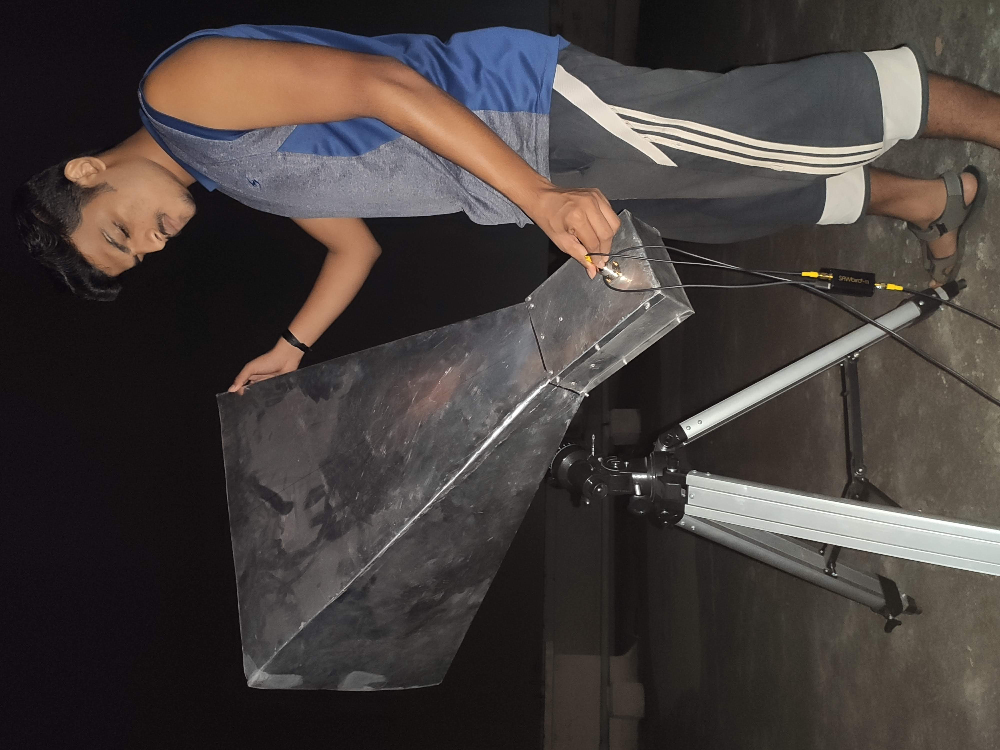

# Horn-antenna-21-cm
This website will help you designing a horn antenna to detect the 21 cm line of neutral hydrogen. There are three major parts to this repo. First section will help you calculating the dimensions of a horn antenna to detect the 21 cm Neutral Hydrogen line. Second will help you install required softwares to analyze data received from the antenna. In the final section you will get to know about few theoratical concepts and plot the milky way rotation curve using the data received from the telescope.

